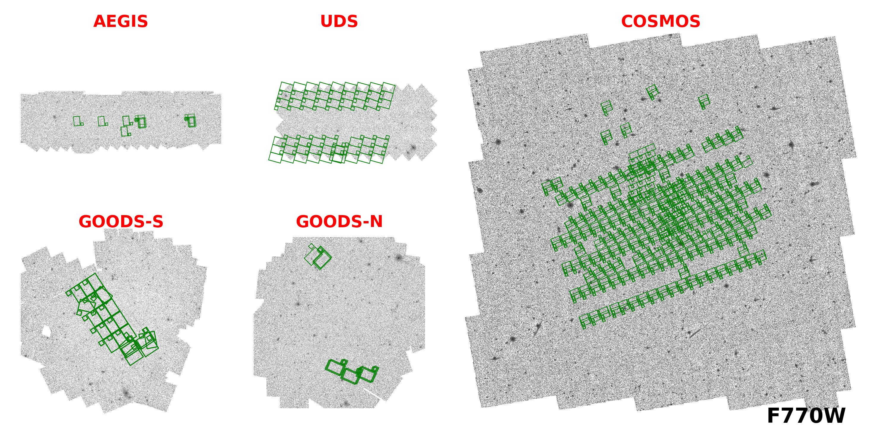

# Coverage

## COSMOS

|      Band       | F606W  | F814W  | F105W | F125W  | F140W  | F160W  |
|:---------------:|:------:|:------:|:-----:|:------:|:------:|:------:|
| Area (arcmin^2) | 274.69 | 503.99 | 53.54 | 221.25 | 153.57 | 254.68 |

|      Band       | F090W  | F115W  | F150W  | F200W  | F212N | F250M | F277W  | F335M | F356W  | F410M  | F444W  | F444W_F466N | F444W_F470N |
|:---------------:|:------:|:------:|:------:|:------:|:-----:|:-----:|:------:|:-----:|:------:|:------:|:------:|:-----------:|:-----------:|
| Area (arcmin^2) | 150.86 | 477.20 | 476.34 | 171.32 | 62.52 | 10.14 | 477.82 | 10.14 | 172.23 | 147.42 | 477.39 |    62.82    |    61.45    |

|      Band       | F770W  | F1800W |
|:---------------:|:------:|:------:|
| Area (arcmin^2) | 259.29 | 110.85 |

From: `pro1727, pro1810, pro1837, pro1840, pro2321, pro2514, pro3990`

Locations: `10.47.1.34:/data3/JWST_SPRING/COSMOS/`

## EGS

|      Band       | F606W  | F814W  | F105W | F125W  | F140W  | F160W  |
|:---------------:|:------:|:------:|:-----:|:------:|:------:|:------:|
| Area (arcmin^2) | 410.26 | 459.78 | 28.16 | 206.33 | 143.19 | 206.40 |

|      Band       | F070W | F090W  | F115W  | F140M | F150W | F182M | F200W | F210M | F277W  | F335M | F356W  | F360M | F410M  | F430M | F444W  | F460M | F444W_F470N | F480M |
|:---------------:|:-----:|:------:|:------:|:-----:|:-----:|:-----:|:-----:|:-----:|:------:|:-----:|:------:|:-----:|:------:|:-----:|:------:|:-----:|:-----------:|:-----:|
| Area (arcmin^2) | 8.98  | 100.21 | 109.37 | 16.72 | 99.10 | 25.59 | 99.77 | 15.62 | 101.92 | 9.21  | 110.93 | 9.21  | 100.57 | 18.31 | 103.00 | 9.22  |    96.48    | 18.27 |

|      Band       | F770W | F1800W |
|:---------------:|:-----:|:------:|
| Area (arcmin^2) | 19.58 |  7.77  |

From: `pro1345, pro2234, pro2279, pro2514, pro2750, pro3990`

Locations: `10.47.1.34:/data3/JWST_SPRING/EGS/`

## GOODSN

|      Band       | F435W  | F606W  | F775W  | F814W  | F850LP |
|:---------------:|:------:|:------:|:------:|:------:|:------:|
| Area (arcmin^2) | 179.78 | 246.30 | 269.02 | 366.22 | 267.17 |

|      Band       | F070W | F090W  | F115W  | F150W  | F150W2_F162M | F182M | F187N | F200W  | F210M | F277W  | F300M | F335M | F356W  | F410M  | F430M | F444W  | F444W_F405N | F460M |
|:---------------:|:-----:|:------:|:------:|:------:|:------------:|:-----:|:-----:|:------:|:-----:|:------:|:-----:|:-----:|:------:|:------:|:-----:|:------:|:-----------:|:-----:|
| Area (arcmin^2) | 31.31 | 108.91 | 146.90 | 129.61 |     9.09     | 92.82 | 32.24 | 103.68 | 66.34 | 103.84 | 7.74  | 79.80 | 148.91 | 111.01 | 9.32  | 147.83 |    33.61    | 9.35  |

From: `pro1181, pro1895, pro2514, pro2674, pro3577`

Locations: `10.47.1.34:/data3/JWST_SPRING/GOODSN/`

## GOODSS
|      Band       | F435W  | F606W  | F775W  | F814W  | F850LP | F105W  | F125W  | F140W  | F160W  |
|:---------------:|:------:|:------:|:------:|:------:|:------:|:------:|:------:|:------:|:------:|
| Area (arcmin^2) | 183.82 | 270.82 | 226.74 | 371.57 | 348.78 | 104.92 | 135.33 | 156.00 | 135.33 |

|      Band       | F070W | F090W  | F115W  | F140M | F150W  | F150W2_F162M | F182M | F200W  | F210M | F250M | F277W  | F300M | F335M | F356W  | F410M  | F430M | F444W  | F460M | F480M |
|:---------------:|:-----:|:------:|:------:|:-----:|:------:|:------------:|:-----:|:------:|:-----:|:-----:|:------:|:-----:|:-----:|:------:|:------:|:-----:|:------:|:-----:|:-----:|
| Area (arcmin^2) | 9.15  | 107.56 | 162.85 | 9.09  | 163.51 |     9.30     | 68.19 | 165.09 |   0   | 16.08 | 160.23 | 9.46  | 50.48 | 171.16 | 101.53 | 10.28 | 180.54 | 10.28 | 10.28 |

From: `pro1176, pro1180, pro1210, pro1283, pro1286, pro1895, pro1963, pro2079, pro2198, pro2514, pro2516, pro3215, pro3990, pro6541`

Locations: `10.47.1.34:/data3/JWST_SPRING/GOODSS/`

## UDS

|      Band       | F606W  | F814W  | F105W | F125W  | F140W  | F160W  |
|:---------------:|:------:|:------:|:-----:|:------:|:------:|:------:|
| Area (arcmin^2) | 250.08 | 249.70 | 16.70 | 201.70 | 103.56 | 201.70 |

|      Band       | F090W  | F115W  | F150W  | F200W  | F277W  | F356W  | F444W  | F770W  | F1800W |
|:---------------:|:------:|:------:|:------:|:------:|:------:|:------:|:------:|:------:|:------:|
| Area (arcmin^2) | 259.35 | 268.11 | 253.87 | 255.97 | 273.67 | 273.70 | 248.06 | 129.59 | 122.62 |

From `pro1837, pro2514, pro3990`

Locations: `10.47.1.34:/data3/JWST_SPRING/UDS/`