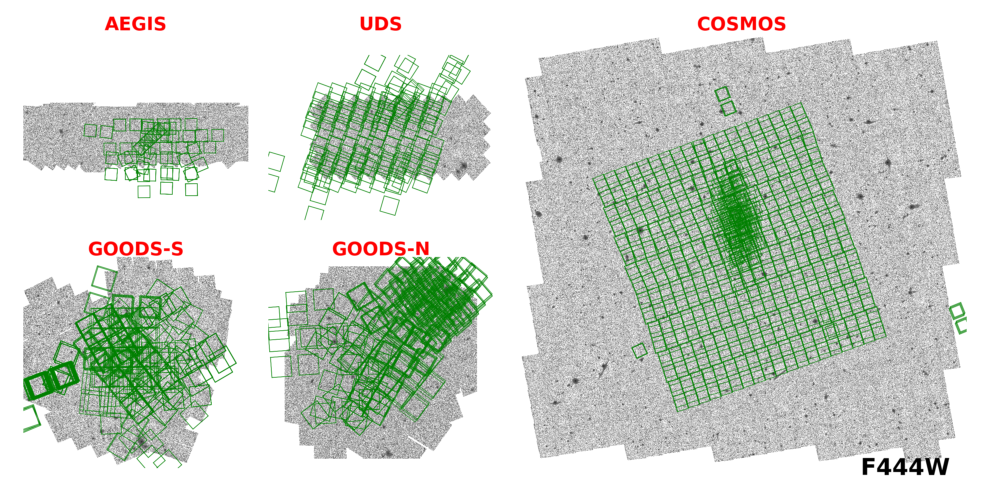

\usepackage{ulem}# Coverage

## COSMOS

|      Band       | F275W  | F435W  | F606W  | F814W  | F105W | F125W  | F140W  | F160W  |
|:---------------:|:------:|:------:|:------:|:------:|:-----:|:------:|:------:|:------:|
| Area (arcmin^2) | 115.02 | 138.22 | 274.69 | 503.99 | 53.54 | 221.25 | 153.57 | 254.68 |

|      Band       | F090W  | F115W  | F150W  | F200W  | F212N | F250M | F277W  | F335M | F356W  | F410M  | F444W  | F444W_F466N | F444W_F470N |
|:---------------:|:------:|:------:|:------:|:------:|:-----:|:-----:|:------:|:-----:|:------:|:------:|:------:|:-----------:|:-----------:|
| Area (arcmin^2) | 150.87 | 477.63 | 476.78 | 210.00 | 62.51 | 10.14 | 477.94 | 10.14 | 211.48 | 147.42 | 477.52 |    62.82    |    61.45    |

|      Band       | F770W  | F1000W | F1800W | F2100W |
|:---------------:|:------:|:------:|:------:|:------:|
| Area (arcmin^2) | 265.74 | 17.08  | 111.04 | 16.96  |

From: `pro1727, pro1810, pro1837, pro1840, pro2321, pro2514, pro3990, pro5893, pro6585`

Locations: `10.47.1.121:/data3/JWST_SPRING/COSMOS/`

## EGS

|      Band       | F275W  | F435W  | F606W  | F814W  | F105W | F125W  | F140W  | F160W  |
|:---------------:|:------:|:------:|:------:|:------:|:-----:|:------:|:------:|:------:|
| Area (arcmin^2) | 141.07 | 147.74 | 410.26 | 459.78 | 28.16 | 206.33 | 143.19 | 206.40 |

|      Band       | F070W | F090W  | F115W  | F140M | F150W  | F182M | F200W  | F210M | F277W  | F335M | F356W  | F360M | F410M  | F430M | F444W  | F460M | F444W_F470N | F480M |
|:---------------:|:-----:|:------:|:------:|:-----:|:------:|:-----:|:------:|:-----:|:------:|:-----:|:------:|:-----:|:------:|:-----:|:------:|:-----:|:-----------:|:-----:|
| Area (arcmin^2) | 8.98  | 119.12 | 111.30 | 16.94 | 102.77 | 25.62 | 117.26 | 15.62 | 105.40 | 9.21  | 114.34 | 9.21  | 100.57 | 18.29 | 125.75 | 9.20  |    96.47    | 24.51 |

|      Band       | F560W | F770W | F1000W | F1280W | F1500W | F1800W | F2100W |
|:---------------:|:-----:|:-----:|:------:|:------:|:------:|:------:|:------:|
| Area (arcmin^2) | 10.45 | 78.58 | 77.04  | 11.83  | 78.20  | 10.41  | 73.10  |

From: `pro1345, pro2234, pro2279, pro2514, pro2750, pro3990, pro4586, pro6434`

Locations: `10.47.1.121:/data3/JWST_SPRING/EGS/`

## GOODSN

|      Band       | F275W  | F435W  | F606W  | F775W  | F814W  | F850LP |
|:---------------:|:------:|:------:|:------:|:------:|:------:|:------:|
| Area (arcmin^2) | 107.87 | 179.78 | 246.30 | 269.02 | 366.22 | 267.17 |

|      Band       | F070W | F090W  | F115W  | F150W  | F150W2_F162M | F182M  | F187N | F200W  | F210M | F277W  | F300M | F335M | F356W  | F410M  | F430M | F444W  | F444W_F405N | F460M |
|:---------------:|:-----:|:------:|:------:|:------:|:------------:|:------:|:-----:|:------:|:-----:|:------:|:-----:|:-----:|:------:|:------:|:-----:|:------:|:-----------:|:-----:|
| Area (arcmin^2) | 31.24 | 125.13 | 175.78 | 142.19 |     9.09     | 102.44 | 29.09 | 148.83 | 73.76 | 111.54 | 7.74  | 79.79 | 161.61 | 107.74 | 9.32  | 206.91 |    30.35    | 9.35  |

|      Band       | F560W | F770W | F1000W | F1280W | F1800W | F2100W |
|:---------------:|:-----:|:-----:|:------:|:------:|:------:|:------:|
| Area (arcmin^2) | 9.78  | 21.00 | 15.54  | 15.94  |  2.56  | 13.67  |

From: `pro1181, pro1895, pro2514, pro2674, pro2926, pro3577, pro4762, pro5398, pro6434`

Locations: `10.47.1.121:/data3/JWST_SPRING/GOODSN/`

## GOODSS
|      Band       | F275W | F435W  | F606W  | F775W  | F814W  | F850LP | F105W  | F125W  | F140W  | F160W  |
|:---------------:|:-----:|:------:|:------:|:------:|:------:|:------:|:------:|:------:|:------:|:------:|
| Area (arcmin^2) | 54.10 | 183.82 | 270.82 | 226.74 | 371.57 | 348.78 | 104.92 | 135.33 | 156.00 | 135.33 |

|      Band       | F070W | F090W  | F115W  | F140M | F150W  | F150W2_F162M | F182M | F200W  | F210M | F250M | F277W  | F300M | F335M  | F356W  | F410M  | F430M | F444W  | F460M | F480M |
|:---------------:|:-----:|:------:|:------:|:-----:|:------:|:------------:|:-----:|:------:|:-----:|:-----:|:------:|:-----:|:------:|:------:|:------:|:-----:|:------:|:-----:|:-----:|
| Area (arcmin^2) | 53.15 | 153.12 | 193.97 | 25.30 | 198.85 |    27.33     | 86.26 | 216.12 | 75.08 | 31.39 | 208.04 | 28.07 | 117.22 | 206.38 | 156.62 | 19.59 | 229.37 | 10.28 | 10.28 |

|      Band       | F560W | F770W | F1000W | F1280W | F1500W | F1800W | F2100W | F2550W |
|:---------------:|:-----:|:-----:|:------:|:------:|:------:|:------:|:------:|:------:|
| Area (arcmin^2) | 35.27 | 59.02 | 36.74  | 49.18  | 54.15  | 36.04  | 38.18  | 36.30  |

From: `pro1176, pro1180, pro1207, pro1210, pro1283, pro1286, pro1287, pro1895, pro1963, pro2079, pro2198, pro2514, pro2516, pro3215, pro3954, pro3990, pro5407, pro6434, pro6511, pro6541`

Locations: `10.47.1.121:/data3/JWST_SPRING/GOODSS/`

## UDS

|      Band       | F606W  | F814W  | F105W | F125W  | F140W  | F160W  |
|:---------------:|:------:|:------:|:-----:|:------:|:------:|:------:|
| Area (arcmin^2) | 250.08 | 249.70 | 16.70 | 201.70 | 103.56 | 201.70 |

|      Band       | F090W  | F115W  | F140M | F150W  | F182M | F200W  | F250M | F277W  | F335M | F356W  | F410M  | F430M | F444W  | F460M | F480M |
|:---------------:|:------:|:------:|:-----:|:------:|:-----:|:------:|:-----:|:------:|:-----:|:------:|:------:|:-----:|:------:|:-----:|:-----:|
| Area (arcmin^2) | 257.91 | 265.52 | 49.42 | 254.37 | 6.77  | 241.60 | 12.11 | 252.21 | 7.44  | 244.51 | 223.81 | 42.96 | 253.71 | 42.53 | 7.44  |

|      Band       | F770W  | F1800W |
|:---------------:|:------:|:------:|
| Area (arcmin^2) | 128.68 | 126.93 |

From `pro1837, pro2514, pro3990`

Locations: `10.47.1.121:/data3/JWST_SPRING/UDS/`