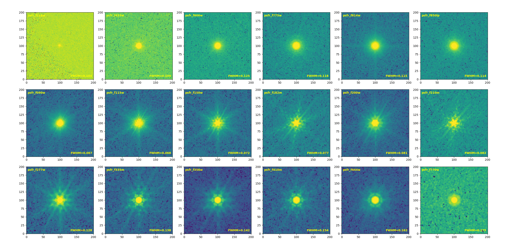

# Data Release

<nav class="section-jump-nav section-jump-nav--four" aria-label="Data release sections">
  <a class="section-jump-nav__item" href="#imaging-data">
    
      <svg viewBox="0 0 24 24"><rect x="3" y="4" width="18" height="16" rx="2"></rect><circle cx="8.5" cy="9" r="1.5"></circle><path d="m5 17 4.5-4 3 2.5 2.5-2 4 3.5"></path></svg>
    
    Imaging Data
  </a>
  <a class="section-jump-nav__item" href="#spectroscopy">
    
      <svg viewBox="0 0 24 24"><path d="M3 17h3l2-9 3 12 2-15 3 12h5"></path></svg>
    
    Spectroscopy
  </a>
  <a class="section-jump-nav__item" href="#photometric-catalog">
    
      <svg viewBox="0 0 24 24"><rect x="4" y="3" width="16" height="18" rx="2"></rect><path d="M8 8h8M8 12h8M8 16h5"></path></svg>
    
    Photometric Catalog
  </a>
  <a class="section-jump-nav__item" href="#point-spread-functions-psfs">
    
      <svg viewBox="0 0 24 24"><circle cx="12" cy="12" r="8"></circle><circle cx="12" cy="12" r="4.5"></circle><circle cx="12" cy="12" r="1.3"></circle></svg>
    
    PSF
  </a>
</nav>

## Imaging Data

  
  Imaging data are coming soon.

### NIRCam

NIRCam imaging products are coming soon.

### MIRI

MIRI imaging products are coming soon.

### AB Magnitude Zero Points

#### HST (from HLF)

|    Band     | F275W | F336W | F435W | F606W | F775W | F814W | F850LP | F105W | F125W | F140W | F160W |
|:-----------:|:-----:|:-----:|:-----:|:-----:|:-----:|:-----:|:------:|:-----:|:-----:|:-----:|:-----:|
| Zero point  | 24.13 | 24.67 | 25.68 | 26.51 | 25.69 | 25.94 | 24.87  | 26.27 | 26.23 | 26.45 | 25.94 |

#### NIRCam

28.08652 (for 0.03\"/pixel)

#### MIRI

28.08652 (for 0.03\"/pixel)

25.70091 (for 0.09\"/pixel)

### Image File Descriptions

| File pattern | Description |
|:-------------|:------------|
| `*drz.fits` | Science image |
| `*wht.fits` | Weight image |
| `*exp.fits` | Exposure image |
| `*err.fits` | Error image |

NIRCam images have a pixel scale of 0.03 arcsec pixel⁻¹, while MIRI images are provided at 0.03 and 0.09 arcsec pixel⁻¹ (identified as 30mas and 90mas in file names).

`PIXAR_SR=2.11539874851881E-14` and `PIXAR_A2=0.0009`

### Processing Versions

#### NIRCam
**v1.0:** Based on the [CEERS NIRCam pipeline](https://github.com/ceers/ceers-nircam), with improved WCS calibration and background subtraction.

**v1.1:** Move the WISP and 1/f correction steps to Stage 2 to allow persistence masking between pipeline stages.

**v1.2:** Improve the 1/f correction by setting the stripe correction to zero for any row or column in which more than 85% of the pixels are masked. Also improve outlier clipping.

**v1.3:** Build a reference catalog from F814W and F160W and use it to create the F150W image. Then build a second reference catalog from F150W and F160W to process NIRCam data in the remaining bands.

**v1.4:** Improve outlier clipping and build the first UDS reference catalog from UKIDSS, F814W, and F160W. Subsequent calibration follows the v1.3 procedure.

**v1.4.1:** Correct WCS issues in COSMOS and UDS for F090W, F115W, and F200W.

**v1.5:** Introduce a [new WISP subtraction algorithm](https://dx.doi.org/10.1088/1538-3873/acea42) (currently not applied to the data), update the [WISP template](https://stsci.app.box.com/s/1bymvf1lkrqbdn9rnkluzqk30e8o2bne), improve mask construction for 1/f removal and background processing, improve outlier clipping, correct a bug in readout-noise construction, and resolve background issues in the files used for the final drizzle.

**v1.6:** Improve readout-noise treatment and add masks for several outlier regions.

**v1.7:** Expand the processed dataset to include all observations available as of August 25, 2026.

`v1.0: JWST calibration pipeline v1.12.5; CRDS pmap 1179`

`v1.1: JWST calibration pipeline v1.12.5; CRDS pmap 1179`

`v1.2: JWST calibration pipeline v1.12.5; CRDS pmap 1183`

`v1.3: JWST calibration pipeline v1.12.5; CRDS pmap 1185`

`v1.4: JWST calibration pipeline v1.12.5; CRDS pmap 1185`

`v1.5: JWST calibration pipeline v1.13.4; CRDS pmap 1236`

`v1.6: JWST calibration pipeline v1.16.1; CRDS pmap 1321`

`v1.7: JWST calibration pipeline v1.16.1; CRDS pmap 1321`

#### MIRI
**v1.0:** Based on the [CEERS MIRI pipeline](https://github.com/ceers/ceers-nircam) and the JWST-SPRING NIRCam v1.1 pipeline.

**v1.1:** Fix a bug that prevented `model.meta.wcs`, `model.meta.wcsinfo`, and `model.meta.cal_step.tweakreg` from being updated in the data model after WCS calibration.

**v1.2:** Following the NIRCam v1.4 procedure, build a reference catalog from F444W and F160W for MIRI WCS calibration.

**v1.3:** Correct WCS calibration issues in the pipeline.

**v1.3.1:** Correct the WCS issue in COSMOS and UDS for F770W.

**v1.4:** Improve flat-image construction for the detection, DQ, and error arrays; update the strategy to create a flat image every six months; and add an outlier-masking step.

**v1.5:** Replace flat-file construction with a super-background approach.

**v1.7:** Expand the processed dataset to include all observations available as of August 25, 2026. Version v1.6 was intentionally skipped to keep the MIRI version numbering consistent with NIRCam.

`v1.0: JWST calibration pipeline v1.12.5; CRDS pmap 1177`

`v1.1: JWST calibration pipeline v1.12.5; CRDS pmap 1179`

`v1.2: JWST calibration pipeline v1.12.5; CRDS pmap 1185`

`v1.3: JWST calibration pipeline v1.12.5; CRDS pmap 1185`

`v1.4: JWST calibration pipeline v1.13.4; CRDS pmap 1216`

`v1.5: JWST calibration pipeline v1.16.1; CRDS pmap 1321`

`v1.7: JWST calibration pipeline v1.16.1; CRDS pmap 1321`

## Spectroscopy

  
  Spectroscopic data processing is in progress.

### NIRCam WFSS (Grism Spectroscopy)

Data processing is in progress.

### NIRSpec Grating Spectroscopy

Data processing is in progress.

## Photometric Catalog

  
  Photometric catalog products are coming soon.

## Point-Spread Functions (PSFs)

  
  PSF products are coming soon.

### HST Empirical FWHM ([Reference](https://ui.adsabs.harvard.edu/abs/2013ApJS..207...24G))

|     Band      | F435W | F606W | F775W | F814W | F850LP | F098M | F105W | F125W | F160W |
|:-------------:|:-----:|:-----:|:-----:|:-----:|:------:|:-----:|:-----:|:-----:|:-----:|
| FWHM (arcsec) | 0.08  | 0.08  | 0.08  | 0.09  |  0.09  | 0.13  | 0.15  | 0.16  | 0.17  |

### Stacked PSFs

#### COSMOS

|     Band      | F606W | F814W |
|:-------------:|:-----:|:-----:|
| FWHM (arcsec) | 0.115 | 0.113 |

|     Band      | F090W | F115W | F150W  | F200W | F212N | F277W | F356W | F410M | F444W | F444W_F466N | F444W_F470N |
|:-------------:|:-----:|:-----:|:------:|:-----:|:-----:|:-----:|:-----:|:-----:|:-----:|:-----------:|:-----------:|
| FWHM (arcsec) | 0.067 | 0.069 | 0.076  | 0.084 | 0.084 | 0.129 | 0.142 | 0.154 | 0.163 |    0.171    |    0.171    |

|     Band      | F770W | F1800W |
|:-------------:|:-----:|:------:|
| FWHM (arcsec) | 0.276 | 0.632  |

#### EGS

|     Band      | F606W | F814W |
|:-------------:|:-----:|:-----:|
| FWHM (arcsec) | 0.109 | 0.113 |

|     Band      | F090W | F115W | F150W | F200W | F277W | F356W | F410M | F444W | F444W_F470N |
|:-------------:|:-----:|:-----:|:-----:|:-----:|:-----:|:-----:|:-----:|:-----:|:-----------:|
| FWHM (arcsec) | 0.067 | 0.068 | 0.072 | 0.080 | 0.129 | 0.145 | 0.155 | 0.164 |    0.171    |

|     Band      | F770W | F1000W | F1500W | F2100W |
|:-------------:|:-----:|:------:|:------:|:------:|
| FWHM (arcsec) | 0.277 | 0.352  | 0.507  | 0.710  |

#### GOODS-N

|     Band      | F435W | F606W | F775W | F814W | F850LP |
|:-------------:|:-----:|:-----:|:-----:|:-----:|:------:|
| FWHM (arcsec) | 0.109 | 0.125 | 0.118 | 0.115 | 0.114  |

|     Band      | F090W | F115W | F150W | F182M | F200W | F210M | F277W | F335M | F356W | F410M | F444W |
|:-------------:|:-----:|:-----:|:-----:|:-----:|:-----:|:-----:|:-----:|:-----:|:-----:|:-----:|:-----:|
| FWHM (arcsec) | 0.067 | 0.068 | 0.072 | 0.077 | 0.081 | 0.082 | 0.128 | 0.138 | 0.142 | 0.154 | 0.162 |

#### GOODS-S

|     Band      | F435W | F606W | F775W | F814W | F850LP |
|:-------------:|:-----:|:-----:|:-----:|:-----:|:------:|
| FWHM (arcsec) | 0.112 | 0.113 | 0.105 | 0.108 | 0.115  |

|     Band      | F070W | F090W | F115W | F150W | F182M | F200W | F210M | F277W | F335M | F356W | F410M | F444W |
|:-------------:|:-----:|:-----:|:-----:|:-----:|:-----:|:-----:|:-----:|:-----:|:-----:|:-----:|:-----:|:-----:|
| FWHM (arcsec) | 0.074 | 0.070 | 0.071 | 0.074 | 0.082 | 0.082 | 0.087 | 0.129 | 0.140 | 0.144 | 0.155 | 0.163 |

|     Band      | F770W | F1500W |
|:-------------:|:-----:|:------:|
| FWHM (arcsec) | 0.290 | 0.404  |

#### UDS

|     Band      | F606W | F814W |
|:-------------:|:-----:|:-----:|
| FWHM (arcsec) | 0.112 | 0.107 |

|     Band      | F090W | F115W | F150W | F200W | F277W | F356W | F410M | F444W |
|:-------------:|:-----:|:-----:|:-----:|:-----:|:-----:|:-----:|:-----:|:-----:|
| FWHM (arcsec) | 0.069 | 0.071 | 0.075 | 0.083 | 0.129 | 0.143 | 0.153 | 0.162 |

|     Band      | F770W | F1800W |
|:-------------:|:-----:|:------:|
| FWHM (arcsec) | 0.284 | 0.602  |
