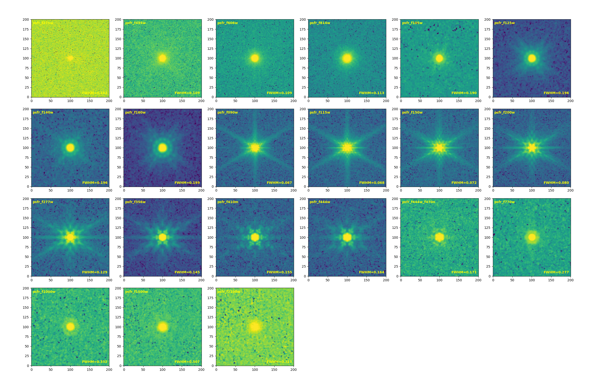

# EGS PSF

<a class="detail-back-link" href="../index.html#point-spread-functions-psfs"><svg viewBox="0 0 24 24" aria-hidden="true"><path d="m14 5-7 7 7 7"></path><path d="M7 12h12"></path></svg>Back to Point-Spread Functions</a>

  
  EGS PSF products are coming soon.

## Stacked PSF

### HST

|     Band      | F606W | F814W |
|:-------------:|:-----:|:-----:|
| FWHM (arcsec) | 0.109 | 0.113 |

### NIRCam

|     Band      | F090W | F115W | F150W | F200W | F277W | F356W | F410M | F444W | F444W_F470N |
|:-------------:|:-----:|:-----:|:-----:|:-----:|:-----:|:-----:|:-----:|:-----:|:-----------:|
| FWHM (arcsec) | 0.067 | 0.068 | 0.072 | 0.080 | 0.129 | 0.145 | 0.155 | 0.164 |    0.171    |

### MIRI

|     Band      | F770W | F1000W | F1500W | F2100W |
|:-------------:|:-----:|:------:|:------:|:------:|
| FWHM (arcsec) | 0.277 | 0.352  | 0.507  | 0.710  |
