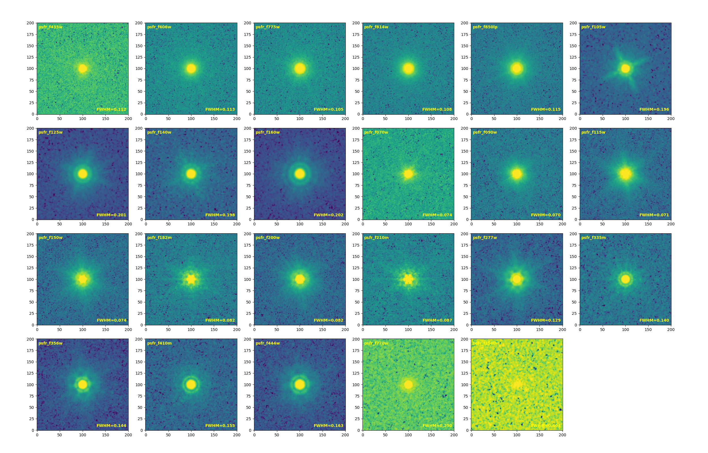

# GOODS-S PSF

<a class="detail-back-link" href="../index.html#point-spread-functions-psfs"><svg viewBox="0 0 24 24" aria-hidden="true"><path d="m14 5-7 7 7 7"></path><path d="M7 12h12"></path></svg>Back to Point-Spread Functions</a>

  
  GOODS-S PSF products are coming soon.

## Stacked PSF

### HST

|     Band      | F435W | F606W | F775W | F814W | F850LP |
|:-------------:|:-----:|:-----:|:-----:|:-----:|:------:|
| FWHM (arcsec) | 0.112 | 0.113 | 0.105 | 0.108 | 0.115  |

### NIRCam

|     Band      | F070W | F090W | F115W | F150W | F182M | F200W | F210M | F277W | F335M | F356W | F410M | F444W |
|:-------------:|:-----:|:-----:|:-----:|:-----:|:-----:|:-----:|:-----:|:-----:|:-----:|:-----:|:-----:|:-----:|
| FWHM (arcsec) | 0.074 | 0.070 | 0.071 | 0.074 | 0.082 | 0.082 | 0.087 | 0.129 | 0.140 | 0.144 | 0.155 | 0.163 |

### MIRI

|     Band      | F770W | F1500W |
|:-------------:|:-----:|:------:|
| FWHM (arcsec) | 0.290 | 0.404  |
