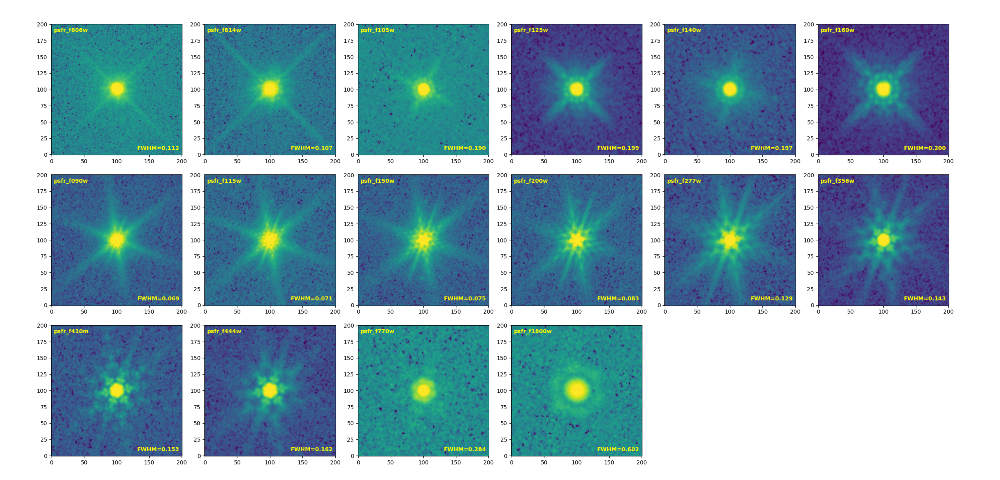

# UDS PSF

<a class="detail-back-link" href="../index.html#point-spread-functions-psfs"><svg viewBox="0 0 24 24" aria-hidden="true"><path d="m14 5-7 7 7 7"></path><path d="M7 12h12"></path></svg>Back to Point-Spread Functions</a>

  
  UDS PSF products are coming soon.

## Stacked PSF

### HST

|     Band      | F606W | F814W |
|:-------------:|:-----:|:-----:|
| FWHM (arcsec) | 0.112 | 0.107 |

### NIRCam

|     Band      | F090W | F115W | F150W | F200W | F277W | F356W | F410M | F444W |
|:-------------:|:-----:|:-----:|:-----:|:-----:|:-----:|:-----:|:-----:|:-----:|
| FWHM (arcsec) | 0.069 | 0.071 | 0.075 | 0.083 | 0.129 | 0.143 | 0.153 | 0.162 |

### MIRI

|     Band      | F770W | F1800W |
|:-------------:|:-----:|:------:|
| FWHM (arcsec) | 0.284 | 0.602  |
