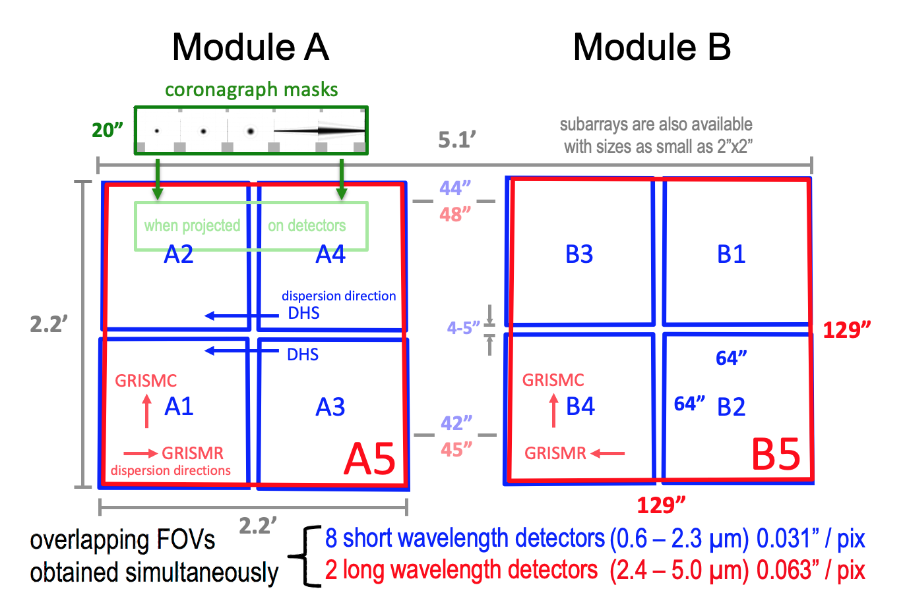

# Detector Performance

## Field of view

## [Average NIRCam detector properties](https://jwst-docs.stsci.edu/jwst-near-infrared-camera/nircam-instrumentation/nircam-detector-overview/nircam-detector-performance#gsc.tab=0)

| Parameter                                                                   |  Short wavelength channel (0.6-2.3 &mu;m)  | Long wavelength channel (2.4-5.0 &mu;m) |
|:----------------------------------------------------------------------------|:----------------------------------------------:|:-------------------------------------------:|
| CDS readnoise (correlated double sampling)                              |             15.77 &plusmn; 0.94e-              |            13.25 &plusmn; 0.08e-            |
| Dark current in 1,000s                                                      |             1.9 &plusmn: 1.1e-/ks              |            34.2 &plusmn; 5e-/ks             |
| Effective noise in 1,000s (93 groups of full-frame RAPID)               |              7.79 &plusmn; 0.68e-              |            9.28 &plusmn; 0.12e-             |
| Gain(e-/ADU)                                                                |               2.05 &plusmn; 0.4                |              1.82 &plusmn; 0.4              |
| Well capacity (saturation level with superbias subtracted)              |            105,750 &plusmn; 2.264e-            |           83,300 &plusmn; 1,200e-           |
| Quantum efficiency (QE)                                                     | 70%@0.6&mu;m 80%@1.0&mu;m 90%@2.0&mu;m |  80%@3&mu;m 90%@4&mu;m 60%@5&mu;m   |
| Interpixel capacitance (IPC)                                                |              0.53% &plusmn; 0.04%              |            0.59% &plusmn; 0.04%             |
| Post-pixel coupling (PPC)                                                   |              0.08% &plusmn; 0.02%              |            0.19% &plusmn; 0.03%             |
| Persistence (for same exposure time as previous nearly saturated image) |                     <0.01%                     |                   <0.01%                    |