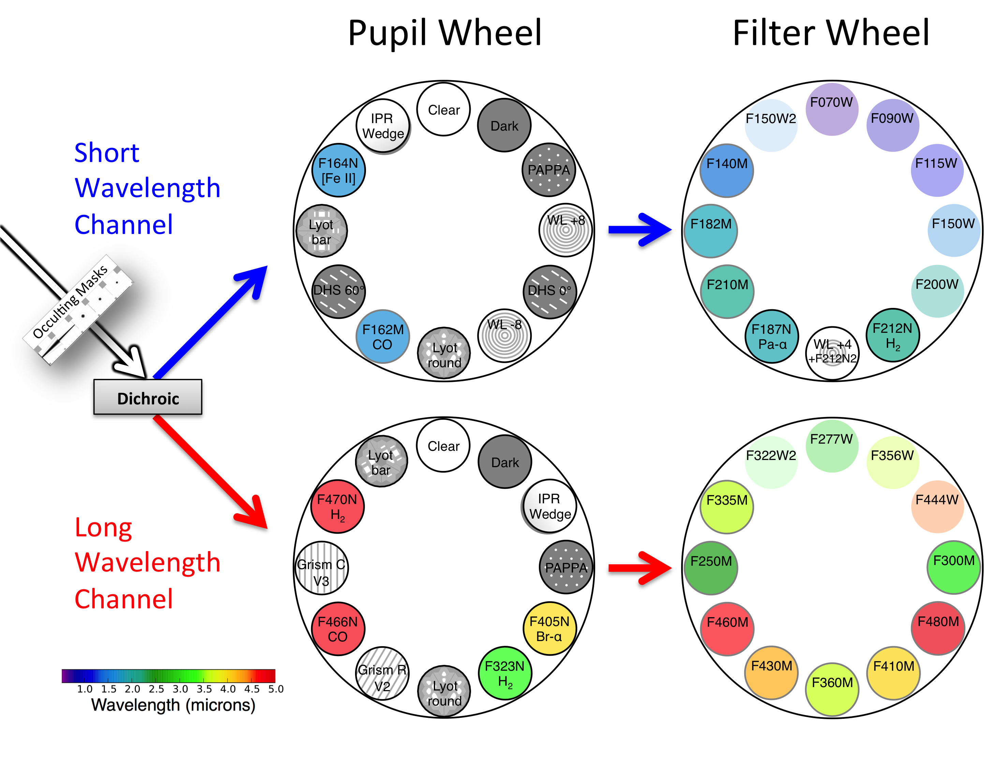
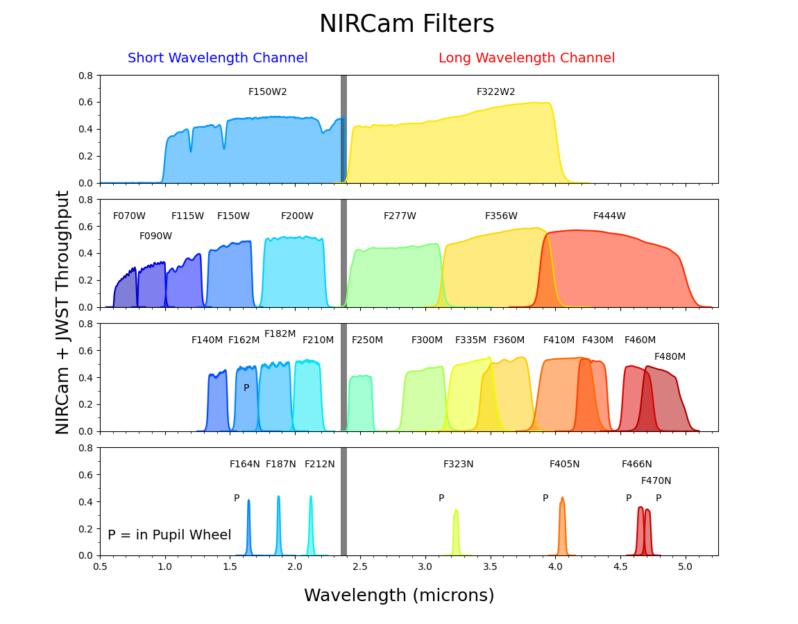
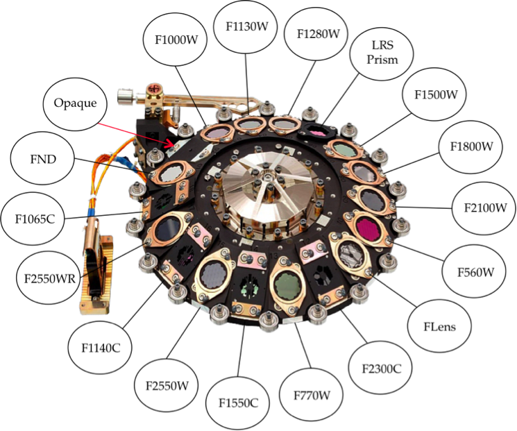
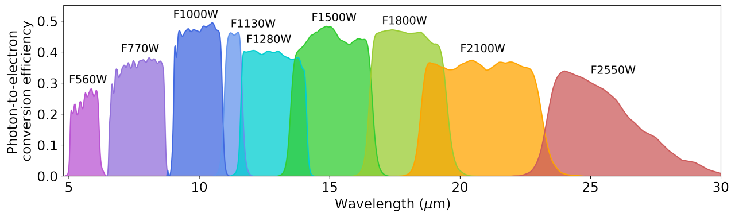

# Filter 

## Filter Wheels and Throughputs 

### NIRCam

### MIRI

## PSF Empirical FWHM

### HST (from [Guo+ 2013](https://ui.adsabs.harvard.edu/abs/2013ApJS..207...24G))

|     Band      | F435W | F606W | F775W | F814W | F850LP | F098M | F105W | F125W | F160W |
|:-------------:|:-----:|:-----:|:-----:|:-----:|:------:|:-----:|:-----:|:-----:|:-----:|
| FWHM (arcsec) | 0.08  | 0.08  | 0.08  | 0.09  |  0.09  | 0.13  | 0.15  | 0.16  | 0.17  |

### JWST (from [JWST Documents](https://jwst-docs.stsci.edu/jwst-near-infrared-camera/nircam-performance/nircam-point-spread-functions#gsc.tab=0))

|     Band      | F070W | F090W  | F115W  | F140M | F150W  | F162M | F164N | F187N | F182M | F200W  | F210M | F212N  | F250M  | F277W | F300M | F323N | F335M | F356W  | F360M | F405N | F410M  | F430M | F444W  | F460M | F466N  | F470N  | F480M |
|:-------------:|:-----:|:------:|:------:|:-----:|:------:|:-----:|:-----:|:-----:|:-----:|:------:|:-----:|:------:|:------:|:-----:|:-----:|:-----:|:-----:|:------:|:-----:|:-----:|:------:|:-----:|:------:|:-----:|:------:|:------:|:-----:|
| FWHM (arcsec) | 0.029 | 0.033  | 0.040  | 0.048 | 0.050  | 0.055 | 0.056 | 0.064 | 0.062 | 0.066  | 0.071 | 0.072  | 0.085  | 0.092 | 0.100 | 0.108 | 0.111 | 0.116  | 0.120 | 0.136 | 0.137  | 0.144 | 0.145  | 0.157 | 0.158  | 0.160  | 0.164 |

|     Band      | F560W | F770W  | F1000W  | F1130W | F1280W  | F1500W | F1800W | F2100W | F2550W |
|:-------------:|:-----:|:------:|:-------:|:------:|:-------:|:------:|:------:|:------:|:------:|
| FWHM (arcsec) | 0.207 | 0.269  |  0.328  | 0.375  |  0.420  | 0.488  | 0.591  | 0.674  | 0.803  |

## Zero point (AB mag)

### HST (from HLF)

|  Band  | zero point |
|:------:|:----------:|
| F275W  |   24.13    |
| F336W  |   24.67    |
| F435W  |   25.68    |
| F606W  |   26.51    |
| F775W  |   25.69    |
| F814W  |   25.94    |
| F850LP |   24.87    |
| F105W  |   26.27    |
| F125W  |   26.23    |
| F140W  |   26.45    |
| F160W  |   25.94    |

### NIRCAM

28.08652 (for 0.03\"/pixel)

### MIRI

28.08652 (for 0.03\"/pixel)

25.70091 (for 0.09\"/pixel)