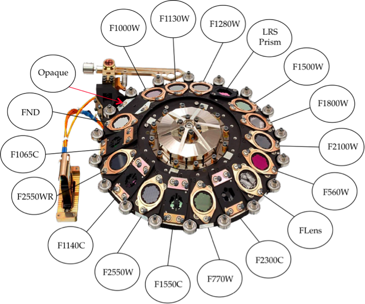
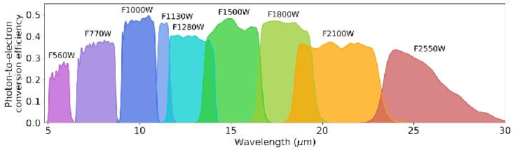
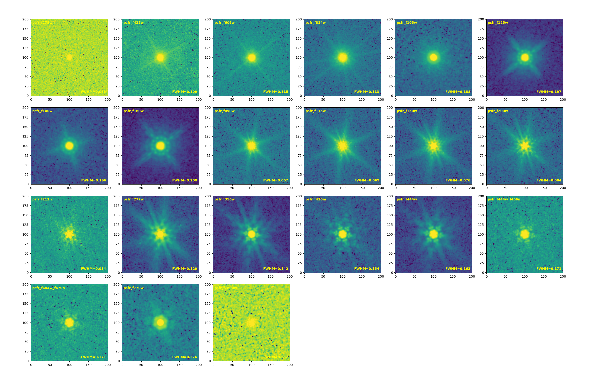
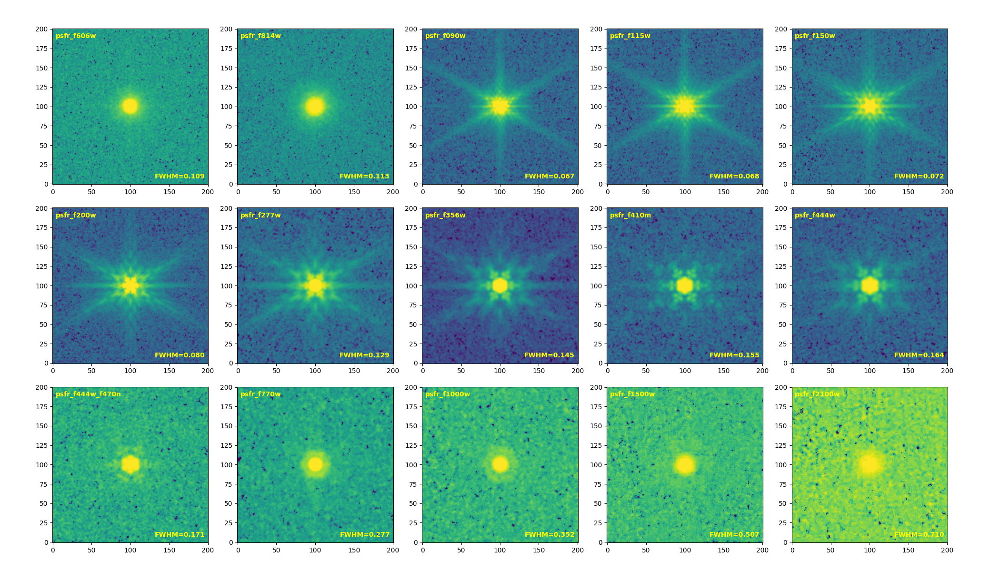
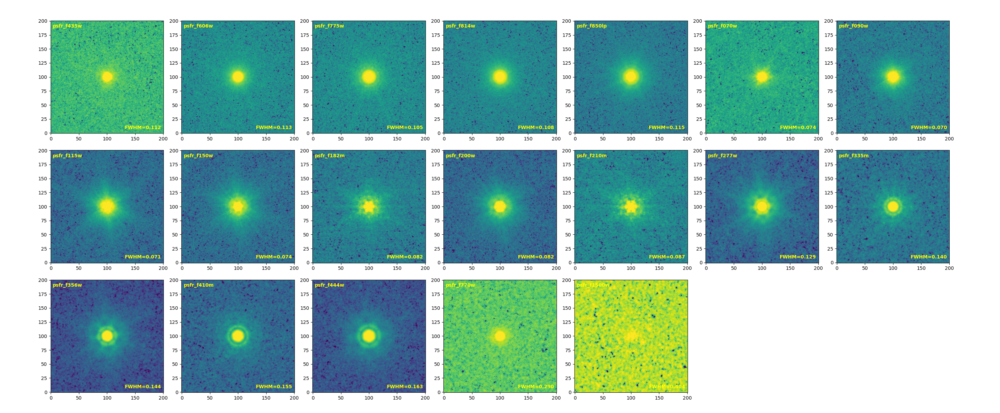
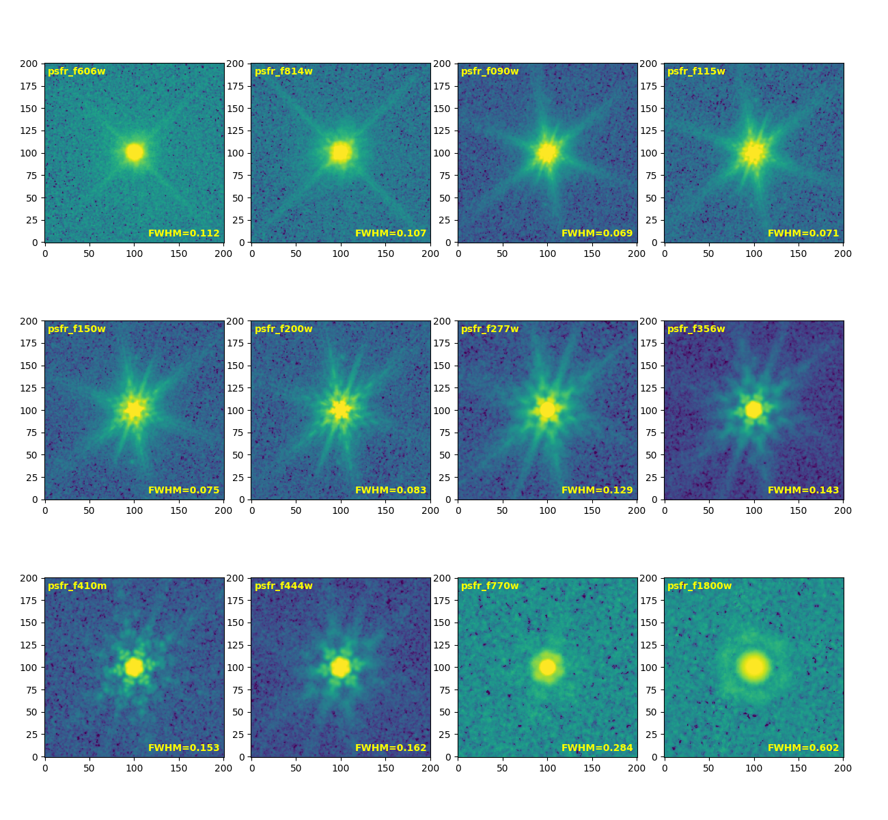

# Filter 

## Filter Wheels and Throughputs 

### NIRCam

### MIRI

## Filter Wavelength

| Filter ID           | &lambda;_ref | &lambda;_eff | &lambda;_min | &lambda;_max |
|:--------------------|:------------:|:------------:|:------------:|:------------:|
| HST/ACS_WFC.F435W   |   4329.85    |   4341.62    |   3610.23    |   4883.77    |
| HST/ACS_WFC.F606W   |   5921.88    |   5809.26    |   4634.30    |   7180.10    |
| HST/ACS_WFC.F775W   |   7693.47    |   7652.44    |   6803.72    |   8631.82    |
| HST/ACS_WFC.F814W   |   8045.53    |   7973.39    |   6869.59    |   9632.01    |
| HST/ACS_WFC.F850LP  |   9031.48    |   9004.99    |   8007.01    |   10862.13   |
| HST/WFC3_IR.F105W   |   10550.25   |   10430.83   |   8955.24    |   12130.55   |
| HST/WFC3_IR.F125W   |   12486.07   |   12363.55   |   10853.22   |   14141.73   |
| HST/WFC3_IR.F140W   |   13923.21   |   13734.66   |   11864.94   |   16133.14   |
| HST/WFC3_IR.F160W   |   15370.34   |   15278.47   |   13857.70   |   17003.09   |
| JWST/NIRCam.F070W   |   7039.12    |   6988.43    |   6048.20    |   7927.07    |
| JWST/NIRCam.F090W   |   9021.53    |   8984.98    |   7881.88    |   10243.08   |
| JWST/NIRCam.F115W   |   11542.61   |   11433.62   |   9975.60    |   13058.40   |
| JWST/NIRCam.F140M   |   14053.23   |   14023.62   |   13042.25   |   15058.58   |
| JWST/NIRCam.F150W   |   15007.44   |   14872.56   |   13041.19   |   16948.89   |
| JWST/NIRCam.F162M   |   16272.47   |   16243.33   |   15126.16   |   17439.17   |
| JWST/NIRCam.F164N   |   16445.36   |   16446.18   |   16171.41   |   16717.72   |
| JWST/NIRCam.F150W2  |   16592.11   |   14793.71   |   9774.71    |   23946.87   |
| JWST/NIRCam.F182M   |   18451.67   |   18388.83   |   16959.53   |   20010.97   |
| JWST/NIRCam.F187N   |   18738.99   |   18737.22   |   18445.28   |   19029.98   |
| JWST/NIRCam.F200W   |   19886.48   |   19680.41   |   17249.08   |   22596.64   |
| JWST/NIRCam.F210M   |   20954.51   |   20908.35   |   19618.54   |   22337.29   |
| JWST/NIRCam.F212N   |   21213.18   |   21211.93   |   20900.93   |   21524.99   |
| JWST/NIRCam.F250M   |   25032.33   |   25005.80   |   23935.49   |   26177.91   |
| JWST/NIRCam.F277W   |   27617.40   |   27278.58   |   23673.12   |   32203.22   |
| JWST/NIRCam.F300M   |   29891.21   |   29818.32   |   27703.55   |   32505.92   |
| JWST/NIRCam.F335M   |   33620.67   |   33537.23   |   31203.36   |   36442.23   |
| JWST/NIRCam.F356W   |   35683.62   |   35287.04   |   30732.91   |   40801.26   |
| JWST/NIRCam.F360M   |   36241.76   |   36148.93   |   33260.34   |   39037.39   |
| JWST/NIRCam.F405N   |   40516.53   |   40515.76   |   40097.87   |   40966.10   |
| JWST/NIRCam.F410M   |   40822.38   |   40723.18   |   37763.56   |   44048.41   |
| JWST/NIRCam.F430M   |   42812.58   |   42784.79   |   41227.68   |   44448.79   |
| JWST/NIRCam.F444W   |   44043.15   |   43504.26   |   38039.57   |   50995.50   |
| JWST/NIRCam.F460M   |   46299.28   |   46269.86   |   44652.64   |   48146.41   |
| JWST/NIRCam.F466N   |   46544.30   |   46540.48   |   46021.35   |   47042.62   |
| JWST/NIRCam.F470N   |   47077.91   |   47077.84   |   46553.98   |   47566.82   |
| JWST/NIRCam.F480M   |   48181.95   |   48139.11   |   45820.02   |   50919.02   |
| JWST/MIRI.F560W     |   56352.56   |   55870.25   |   48944.36   |   64279.58   |
| JWST/MIRI.F770W     |   76393.34   |   75224.94   |   64802.79   |   88382.09   |
| JWST/MIRI.F1000W    |   99531.16   |   98793.45   |   87645.92   |  111053.33   |
| JWST/MIRI.F1280W    |  128101.38   |  127059.68   |  112674.80   |  143435.71   |
| JWST/MIRI.F1500W    |  150635.06   |  149257.07   |  131345.04   |  171580.84   |
| JWST/MIRI.F1800W    |  179837.22   |  178734.17   |  160441.28   |  203000.78   |
| JWST/MIRI.F2100W    |  207950.05   |  205601.06   |  179077.84   |  244780.51   |
| JWST/MIRI.F2550W    |  253640.02   |  251515.99   |  223494.34   |  299940.00   |

## PSF Empirical FWHM

### HST ([Link](https://ui.adsabs.harvard.edu/abs/2013ApJS..207...24G))

|     Band      | F435W | F606W | F775W | F814W | F850LP | F098M | F105W | F125W | F160W |
|:-------------:|:-----:|:-----:|:-----:|:-----:|:------:|:-----:|:-----:|:-----:|:-----:|
| FWHM (arcsec) | 0.08  | 0.08  | 0.08  | 0.09  |  0.09  | 0.13  | 0.15  | 0.16  | 0.17  |

### JWST ([Link](https://jwst-docs.stsci.edu/jwst-near-infrared-camera/nircam-performance/nircam-point-spread-functions#gsc.tab=0))

|     Band      | F560W | F770W  | F1000W  | F1130W | F1280W  | F1500W | F1800W | F2100W | F2550W |
|:-------------:|:-----:|:------:|:-------:|:------:|:-------:|:------:|:------:|:------:|:------:|
| FWHM (arcsec) | 0.207 | 0.269  |  0.328  | 0.375  |  0.420  | 0.488  | 0.591  | 0.674  | 0.803  |

### Stacked PSF

#### COSMOS

|     Band      | F606W | F814W |
|:-------------:|:-----:|:-----:|
| FWHM (arcsec) | 0.115 | 0.113 |

|     Band      | F090W | F115W | F150W  | F200W | F212N | F277W | F356W | F410M | F444W | F444W_F466N | F444W_F470N |
|:-------------:|:-----:|:-----:|:------:|:-----:|:-----:|:-----:|:-----:|:-----:|:-----:|:-----------:|:-----------:|
| FWHM (arcsec) | 0.067 | 0.069 | 0.076  | 0.084 | 0.084 | 0.129 | 0.142 | 0.154 | 0.163 |    0.171    |    0.171    |

|     Band      | F770W | F1800W |
|:-------------:|:-----:|:------:|
| FWHM (arcsec) | 0.276 | 0.632  |

#### EGS

|     Band      | F606W | F814W |
|:-------------:|:-----:|:-----:|
| FWHM (arcsec) | 0.109 | 0.113 |

|     Band      | F090W | F115W | F150W | F200W | F277W | F356W | F410M | F444W | F444W_F470N |
|:-------------:|:-----:|:-----:|:-----:|:-----:|:-----:|:-----:|:-----:|:-----:|:-----------:|
| FWHM (arcsec) | 0.067 | 0.068 | 0.072 | 0.080 | 0.129 | 0.145 | 0.155 | 0.164 |    0.171    |

|     Band      | F770W | F1000W | F1500W | F2100W |
|:-------------:|:-----:|:------:|:------:|:------:|
| FWHM (arcsec) | 0.277 | 0.352  | 0.507  | 0.710  |

#### GOODSN

|     Band      | F435W | F606W | F775W | F814W | F850LP |
|:-------------:|:-----:|:-----:|:-----:|:-----:|:------:|
| FWHM (arcsec) | 0.109 | 0.125 | 0.118 | 0.115 | 0.114  |

|     Band      | F090W | F115W | F150W | F182M | F200W | F210M | F277W | F335M | F356W | F410M | F444W |
|:-------------:|:-----:|:-----:|:-----:|:-----:|:-----:|:-----:|:-----:|:-----:|:-----:|:-----:|:-----:|
| FWHM (arcsec) | 0.067 | 0.068 | 0.072 | 0.077 | 0.081 | 0.082 | 0.128 | 0.138 | 0.142 | 0.154 | 0.162 |

#### GOODSS

|     Band      | F435W | F606W | F775W | F814W | F850LP |
|:-------------:|:-----:|:-----:|:-----:|:-----:|:------:|
| FWHM (arcsec) | 0.112 | 0.113 | 0.105 | 0.108 | 0.115  |

|     Band      | F070W | F090W | F115W | F150W | F182M | F200W | F210M | F277W | F335M | F356W | F410M | F444W |
|:-------------:|:-----:|:-----:|:-----:|:-----:|:-----:|:-----:|:-----:|:-----:|:-----:|:-----:|:-----:|:-----:|
| FWHM (arcsec) | 0.074 | 0.070 | 0.071 | 0.074 | 0.082 | 0.082 | 0.087 | 0.129 | 0.140 | 0.144 | 0.155 | 0.163 |

|     Band      | F770W | F1500W |
|:-------------:|:-----:|:------:|
| FWHM (arcsec) | 0.290 | 0.404  |

#### UDS

|     Band      | F606W | F814W |
|:-------------:|:-----:|:-----:|
| FWHM (arcsec) | 0.112 | 0.107 |

|     Band      | F090W | F115W | F150W | F200W | F277W | F356W | F410M | F444W |
|:-------------:|:-----:|:-----:|:-----:|:-----:|:-----:|:-----:|:-----:|:-----:|
| FWHM (arcsec) | 0.069 | 0.071 | 0.075 | 0.083 | 0.129 | 0.143 | 0.153 | 0.162 |

|     Band      | F770W | F1800W |
|:-------------:|:-----:|:------:|
| FWHM (arcsec) | 0.284 | 0.602  |

## Zero point (AB mag)

### HST (from HLF)

|    Band     | F275W | F336W | F435W | F606W | F775W | F814W | F850LP | F105W | F125W | F140W | F160W |
|:-----------:|:-----:|:-----:|:-----:|:-----:|:-----:|:-----:|:------:|:-----:|:-----:|:-----:|:-----:|
|  zero point | 24.13 | 24.67 | 25.68 | 26.51 | 25.69 | 25.94 | 24.87  | 26.27 | 26.23 | 26.45 | 25.94 |

### NIRCAM

28.08652 (for 0.03\"/pixel)

### MIRI

28.08652 (for 0.03\"/pixel)

25.70091 (for 0.09\"/pixel)