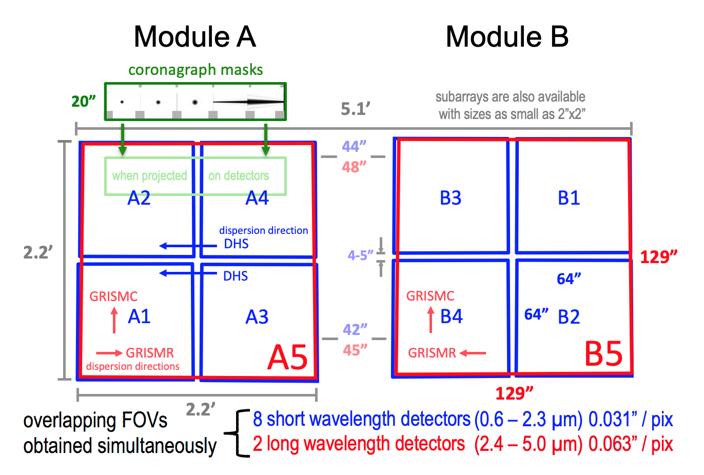
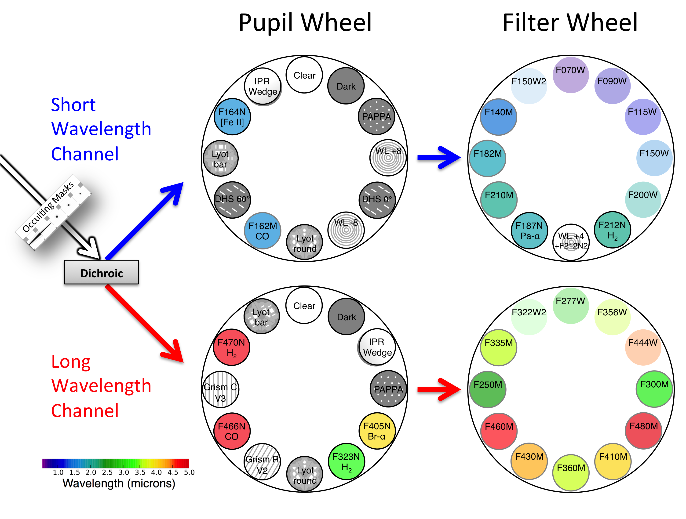
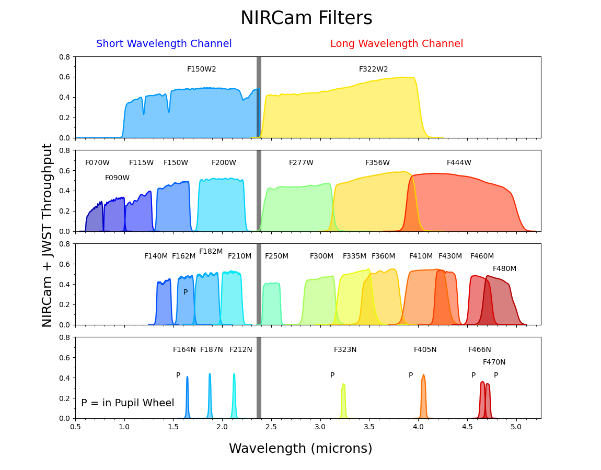

# Instruments

<nav class="section-jump-nav section-jump-nav--three" aria-label="Instrument sections">
  <a class="section-jump-nav__item" href="#detectors">
    
      <svg viewBox="0 0 24 24"><rect x="4" y="3" width="16" height="18" rx="2"></rect><path d="M8 7h8v6H8zM8 17h2M12 17h4"></path></svg>
    
    Detectors
  </a>
  <a class="section-jump-nav__item" href="#filters-throughputs">
    
      <svg viewBox="0 0 24 24"><circle cx="9" cy="12" r="6.5"></circle><circle cx="9" cy="12" r="1.5"></circle><circle cx="9" cy="7.5" r="1.25"></circle><circle cx="13" cy="14" r="1.25"></circle><path d="M15.5 9.5H21M18 6.5l3 3-3 3"></path></svg>
    
    Filters &amp; Throughputs
  </a>
  <a class="section-jump-nav__item" href="#filter-wavelength-parameters">
    
      <svg viewBox="0 0 24 24"><path d="M3 12c2.2-6 4.5-6 6.7 0s4.5 6 6.7 0S20.8 6 23 12"></path><path d="M3 18h20M6 16v4M12 16v4M18 16v4"></path></svg>
    
    Filter Wavelength Parameters
  </a>
</nav>

## Detectors

### NIRCam Field of View

### Detector Properties

#### NIRCam ([JWST Documentation](https://jwst-docs.stsci.edu/jwst-near-infrared-camera/nircam-instrumentation/nircam-detector-overview/nircam-detector-performance#gsc.tab=0))

Average Properties of the NIRCam Detectors

| Parameter                                                                   |  Short wavelength channel (0.6-2.3 &mu;m)  | Long wavelength channel (2.4-5.0 &mu;m) |
|:----------------------------------------------------------------------------|:----------------------------------------------:|:-------------------------------------------:|
| CDS readnoise (correlated double sampling)                              |             15.77 &plusmn; 0.94e-              |            13.25 &plusmn; 0.08e-            |
| Dark current in 1,000s                                                      |             1.9 &plusmn; 1.1e-/ks              |            34.2 &plusmn; 5e-/ks             |
| Effective noise in 1,000s (93 groups of full-frame RAPID)               |              7.79 &plusmn; 0.68e-              |            9.28 &plusmn; 0.12e-             |
| Gain(e-/ADU)                                                                |               2.05 &plusmn; 0.4                |              1.82 &plusmn; 0.4              |
| Well capacity (saturation level with superbias subtracted)              |            105,750 &plusmn; 2.264e-            |           83,300 &plusmn; 1,200e-           |
| Quantum efficiency (QE)                                                     | 70%@0.6&mu;m 80%@1.0&mu;m 90%@2.0&mu;m |  80%@3&mu;m 90%@4&mu;m 60%@5&mu;m   |
| Interpixel capacitance (IPC)                                                |              0.53% &plusmn; 0.04%              |            0.59% &plusmn; 0.04%             |
| Post-pixel coupling (PPC)                                                   |              0.08% &plusmn; 0.02%              |            0.19% &plusmn; 0.03%             |
| Persistence (for same exposure time as previous nearly saturated image) |                     <0.01%                     |                   <0.01%                    |

Properties of Individual NIRCam Detectors

| Detector | 	CDS read noise (e–) | Dark current (e–/ks) | Effective noise in 1,000 s (e–) | Gain (e–/ADU) | Saturation raw (ADU) |
|:--------:|:------------------------:|:------------------------:|:-----------------------------------:|:-----------------:|:--------------------:|
|   A1	    |       15.99 ± 1.38       |        	0.3 ± 1.6        |            	6.86 ± 1.79             |       2.08        |    60,300 ± 1,760    |
|   A2	    |       17.18 ± 1.51       |      	    2.7 ± 1.9      |          	    8.61 ± 2.12	          |       2.02        |    	63,100 ± 600     |
|   A3	    |       14.80 ± 1.29       |        	2.8 ± 1.6        |            	8.40 ± 2.59	            |       2.17        |    	59,300 ± 220     |
|   A4	    |       15.06 ± 1.30       |        	3.3 ± 1.8        |            	7.36 ± 1.92	            |       2.02        |   	62,000 ± 1,330    |
|   B1	    |       16.76 ± 1.46       |        	2.2 ± 1.5        |            	6.83 ± 1.77	            |       2.01        |    	62,300 ± 440     |
|   B2	    |       15.84 ± 1.37       |        	0.8 ± 1.5        |            	7.73 ± 2.14	            |       2.14        |    	61,000 ± 360     |
|   B3	    |       16.30 ± 1.42       |        	1.7 ± 1.4        |            	7.98 ± 2.27	            |       1.94        |    	62,500 ± 860     |
|   B4	    |       14.23 ± 1.24       |        	1.1 ± 1.8        |            	8.57 ± 2.99	            |       2.03        |    	61,000 ± 520     |
|   A5	    |       13.17 ± 1.14       |     	    33.5 ± 3.1      |            	9.16 ± 2.57	            |       1.84        |    	 59,200 ± 960    |
|   B5	    |       13.33 ± 1.18       |     	    35.0 ± 2.5      |            	9.39 ± 2.20	            |       1.80        |    	58,500 ± 470     |

#### MIRI ([JWST Documentation](https://jwst-docs.stsci.edu/jwst-mid-infrared-instrument/miri-instrumentation/miri-detector-overview/miri-detector-performance#gsc.tab=0))

|      Parameter       |  	Value  |
|:--------------------:|:--------:|
| Pixel gain (e–/ADU)  |    ~4    |
| Dark current (e–/s)  |   ~0.2   |
|   Read noise (DN)    |    ~6    |
|  Latent images (%)   |  	 < 1   |
|    Full well (e–)    | ~210,000 |

## Filters & Throughputs

### NIRCam

### MIRI

## Filter Wavelength Parameters

| Filter ID           | &lambda;_ref | &lambda;_eff | &lambda;_min | &lambda;_max |
|:--------------------|:------------:|:------------:|:------------:|:------------:|
| HST/ACS_WFC.F435W   |   4329.85    |   4341.62    |   3610.23    |   4883.77    |
| HST/ACS_WFC.F606W   |   5921.88    |   5809.26    |   4634.30    |   7180.10    |
| HST/ACS_WFC.F775W   |   7693.47    |   7652.44    |   6803.72    |   8631.82    |
| HST/ACS_WFC.F814W   |   8045.53    |   7973.39    |   6869.59    |   9632.01    |
| HST/ACS_WFC.F850LP  |   9031.48    |   9004.99    |   8007.01    |   10862.13   |
| HST/WFC3_IR.F105W   |   10550.25   |   10430.83   |   8955.24    |   12130.55   |
| HST/WFC3_IR.F125W   |   12486.07   |   12363.55   |   10853.22   |   14141.73   |
| HST/WFC3_IR.F140W   |   13923.21   |   13734.66   |   11864.94   |   16133.14   |
| HST/WFC3_IR.F160W   |   15370.34   |   15278.47   |   13857.70   |   17003.09   |
| JWST/NIRCam.F070W   |   7039.12    |   6988.43    |   6048.20    |   7927.07    |
| JWST/NIRCam.F090W   |   9021.53    |   8984.98    |   7881.88    |   10243.08   |
| JWST/NIRCam.F115W   |   11542.61   |   11433.62   |   9975.60    |   13058.40   |
| JWST/NIRCam.F140M   |   14053.23   |   14023.62   |   13042.25   |   15058.58   |
| JWST/NIRCam.F150W   |   15007.44   |   14872.56   |   13041.19   |   16948.89   |
| JWST/NIRCam.F162M   |   16272.47   |   16243.33   |   15126.16   |   17439.17   |
| JWST/NIRCam.F164N   |   16445.36   |   16446.18   |   16171.41   |   16717.72   |
| JWST/NIRCam.F150W2  |   16592.11   |   14793.71   |   9774.71    |   23946.87   |
| JWST/NIRCam.F182M   |   18451.67   |   18388.83   |   16959.53   |   20010.97   |
| JWST/NIRCam.F187N   |   18738.99   |   18737.22   |   18445.28   |   19029.98   |
| JWST/NIRCam.F200W   |   19886.48   |   19680.41   |   17249.08   |   22596.64   |
| JWST/NIRCam.F210M   |   20954.51   |   20908.35   |   19618.54   |   22337.29   |
| JWST/NIRCam.F212N   |   21213.18   |   21211.93   |   20900.93   |   21524.99   |
| JWST/NIRCam.F250M   |   25032.33   |   25005.80   |   23935.49   |   26177.91   |
| JWST/NIRCam.F277W   |   27617.40   |   27278.58   |   23673.12   |   32203.22   |
| JWST/NIRCam.F300M   |   29891.21   |   29818.32   |   27703.55   |   32505.92   |
| JWST/NIRCam.F335M   |   33620.67   |   33537.23   |   31203.36   |   36442.23   |
| JWST/NIRCam.F356W   |   35683.62   |   35287.04   |   30732.91   |   40801.26   |
| JWST/NIRCam.F360M   |   36241.76   |   36148.93   |   33260.34   |   39037.39   |
| JWST/NIRCam.F405N   |   40516.53   |   40515.76   |   40097.87   |   40966.10   |
| JWST/NIRCam.F410M   |   40822.38   |   40723.18   |   37763.56   |   44048.41   |
| JWST/NIRCam.F430M   |   42812.58   |   42784.79   |   41227.68   |   44448.79   |
| JWST/NIRCam.F444W   |   44043.15   |   43504.26   |   38039.57   |   50995.50   |
| JWST/NIRCam.F460M   |   46299.28   |   46269.86   |   44652.64   |   48146.41   |
| JWST/NIRCam.F466N   |   46544.30   |   46540.48   |   46021.35   |   47042.62   |
| JWST/NIRCam.F470N   |   47077.91   |   47077.84   |   46553.98   |   47566.82   |
| JWST/NIRCam.F480M   |   48181.95   |   48139.11   |   45820.02   |   50919.02   |
| JWST/MIRI.F560W     |   56352.56   |   55870.25   |   48944.36   |   64279.58   |
| JWST/MIRI.F770W     |   76393.34   |   75224.94   |   64802.79   |   88382.09   |
| JWST/MIRI.F1000W    |   99531.16   |   98793.45   |   87645.92   |  111053.33   |
| JWST/MIRI.F1280W    |  128101.38   |  127059.68   |  112674.80   |  143435.71   |
| JWST/MIRI.F1500W    |  150635.06   |  149257.07   |  131345.04   |  171580.84   |
| JWST/MIRI.F1800W    |  179837.22   |  178734.17   |  160441.28   |  203000.78   |
| JWST/MIRI.F2100W    |  207950.05   |  205601.06   |  179077.84   |  244780.51   |
| JWST/MIRI.F2550W    |  253640.02   |  251515.99   |  223494.34   |  299940.00   |
