# Team

  <article class="team-card">
    
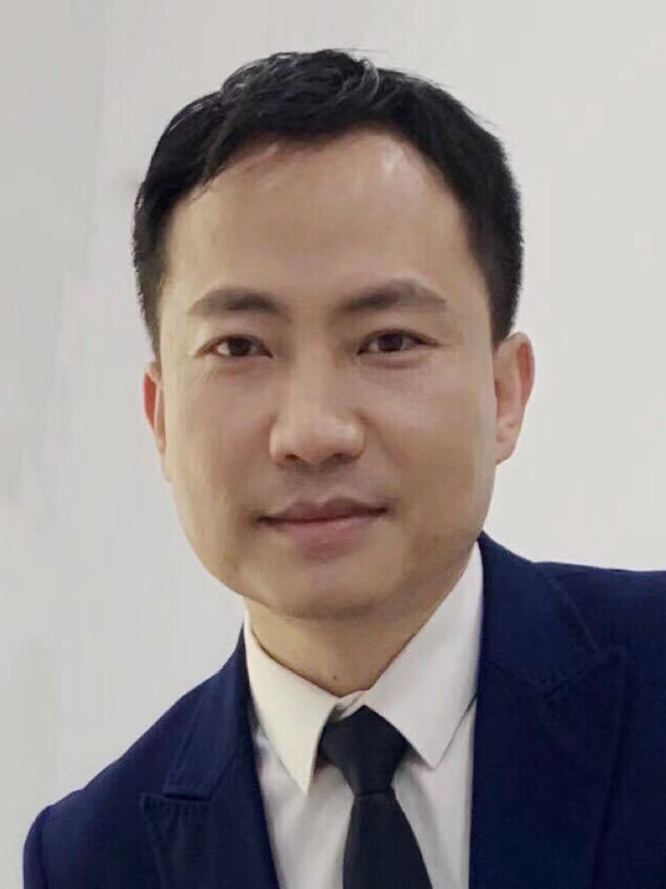

    

      <h2 class="team-card__name">Fengshan Liu <a class="team-card__orcid" href="https://orcid.org/0009-0001-7105-2284" target="_blank" rel="noopener" aria-label="Fengshan Liu ORCID: 0009-0001-7105-2284">iD</a> Co-founder</h2>
      
Professor

      
National Astronomical Observatories, Chinese Academy of Sciences

      <a class="team-card__email" href="mailto:fsliu@nao.cas.cn">fsliu@nao.cas.cn</a>
      
Research interests

      

        Space-based Astronomy and Engineering (including HST, JWST, CSST, Euclid and Roman)
        Observational Extragalactic Astronomy
        Extragalactic Surveys, Datasets, and Catalogs
        Galaxy Formation and Evolution
      

    

  </article>

  <article class="team-card">
    
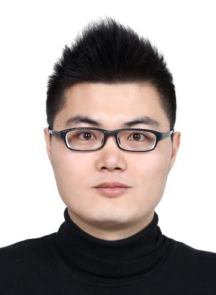

    

      <h2 class="team-card__name">Nan Li Co-founder</h2>
      
Professor

      
National Astronomical Observatories, Chinese Academy of Sciences

      <a class="team-card__email" href="mailto:nan.li@nao.cas.cn">nan.li@nao.cas.cn</a>
      
Research interests

      

        Galaxy Evolution
        Dark Matter
        Dark Energy
        AI4Astronomy
      

    

  </article>

  <article class="team-card">
    

    

      <h2 class="team-card__name">Hassen M. Yesuf <a class="team-card__orcid" href="https://orcid.org/0000-0002-4176-9145" target="_blank" rel="noopener" aria-label="Hassen M. Yesuf ORCID: 0000-0002-4176-9145">iD</a></h2>
      
Associate Professor

      
Shanghai Astronomical Observatory, Chinese Academy of Sciences

      <a class="team-card__email" href="mailto:myesuf@gmail.com">myesuf@gmail.com</a>
      
Research interests

      

        Galaxy Formation &amp; Evolution (Star Formation, AGN Feedback, Gas in Galaxies, and etc.)
        Applications of Statistics and Machine Learning to Astrophysical Data
      

    

  </article>

  <article class="team-card">
    
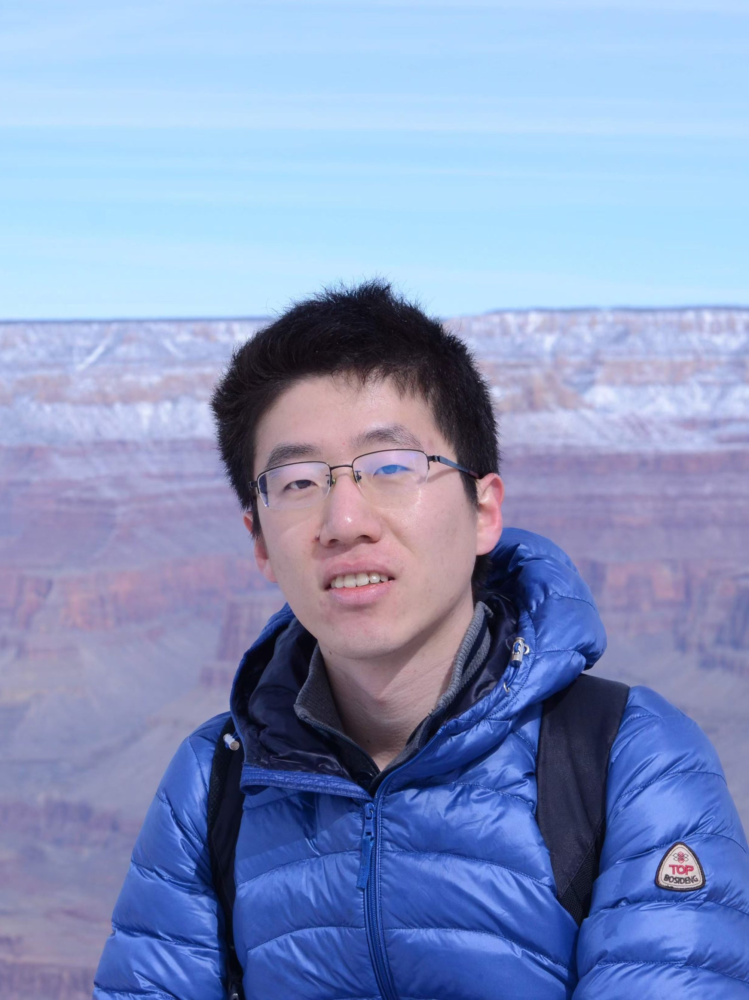

    

      <h2 class="team-card__name">Weichen Wang</h2>
      
Postdoc

      
University of Milano-Bicocca (Milan)

      
Research interests

      

        Galaxy Formation in the Cosmic Web
        Galactic Winds
        Large-scale Structure at Intermediate to High Redshifts
      

    

  </article>

  <article class="team-card">
    

    

      <h2 class="team-card__name">Xin Zhang</h2>
      
Associate Researcher

      
National Astronomical Observatories, Chinese Academy of Sciences

      
Research interests

      

        Data SimulationData ReductionCCD Technology
      

    

  </article>

  <article class="team-card">
    
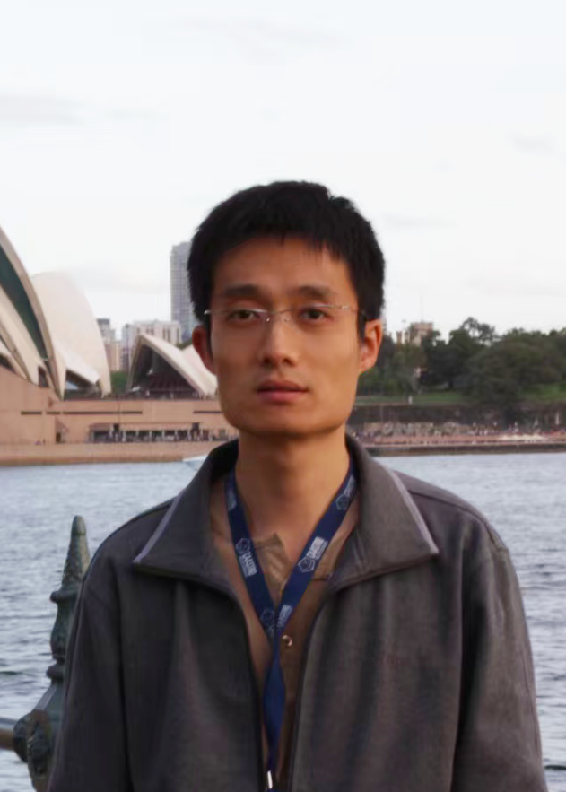

    

      <h2 class="team-card__name">Xianmin Meng</h2>
      
Associate Researcher

      
National Astronomical Observatories, Chinese Academy of Sciences

      
Research interests

      

        Galaxy EvolutionData SimulationData Reduction
      

    

  </article>

  <article class="team-card">
    
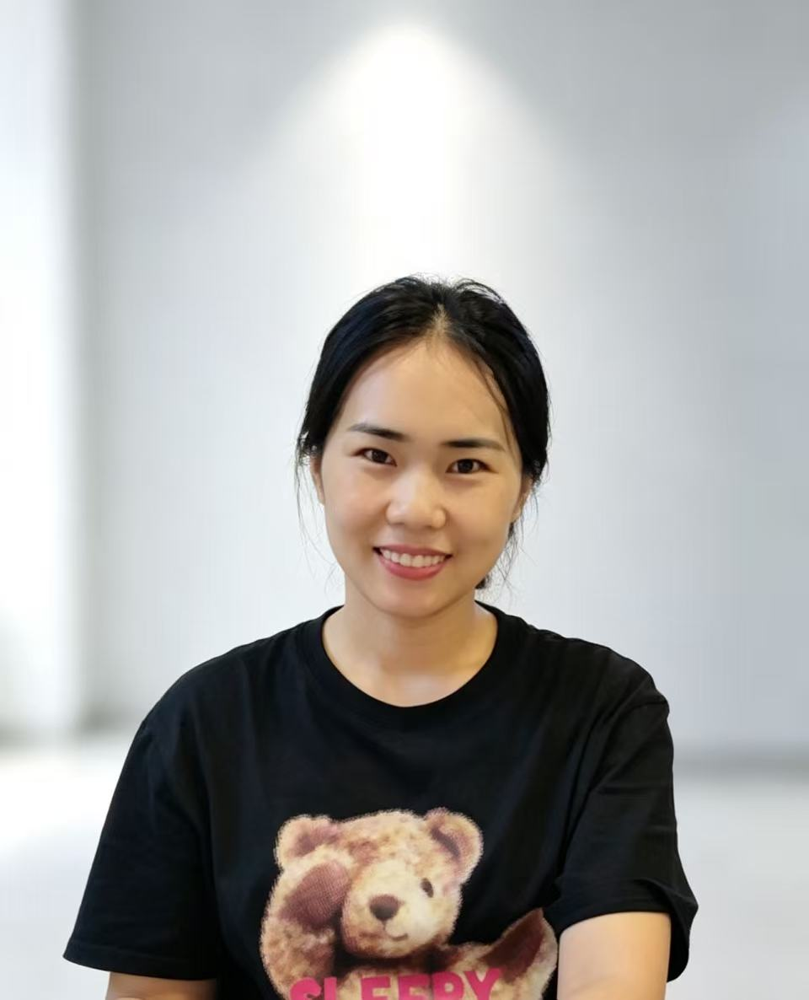

    

      <h2 class="team-card__name">Fengjie Lei</h2>
      
Assistant Researcher

      
National Astronomical Observatories, Chinese Academy of Sciences

      
Research interests

      

        Star Formation in GalaxiesLow Surface Brightness GalaxiesHα Imaging Observations
      

    

  </article>

  <article class="team-card">
    
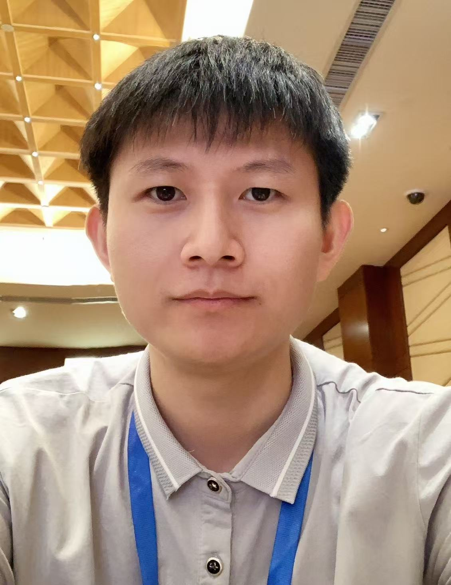

    

      <h2 class="team-card__name">Jian Ren <a class="team-card__orcid" href="https://orcid.org/0000-0002-5043-2886" target="_blank" rel="noopener" aria-label="Jian Ren ORCID: 0000-0002-5043-2886">iD</a></h2>
      
Assistant Professor

      
National Astronomical Observatories, Chinese Academy of Sciences

      <a class="team-card__email" href="mailto:renjian@bao.ac.cn">renjian@bao.ac.cn</a>
      
Research interests

      
Galaxy Formation and Evolution

    

  </article>

  <article class="team-card">
    
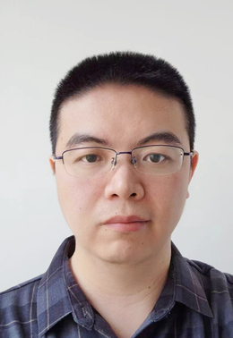

    

      <h2 class="team-card__name">Chenxiaoji Ling</h2>
      
Postdoc

      
National Astronomical Observatories, Chinese Academy of Sciences

      
Research interests

      
Galaxy Formation and EvolutionInfrared Astronomy

    

  </article>

  <article class="team-card">
    
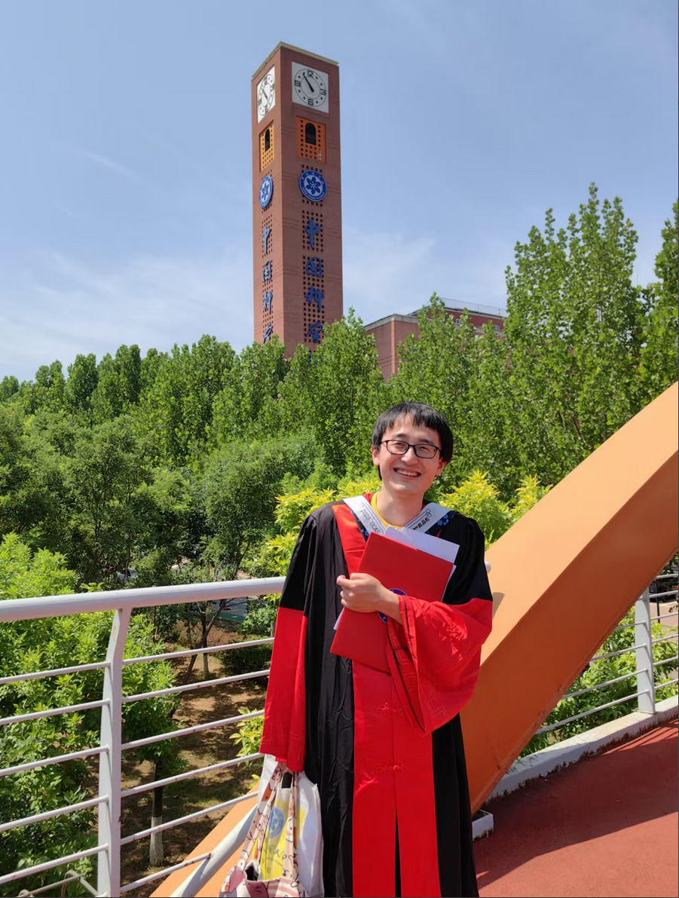

    

      <h2 class="team-card__name">Pinsong Zhao <a class="team-card__orcid" href="https://orcid.org/0000-0002-4328-538X" target="_blank" rel="noopener" aria-label="Pinsong Zhao ORCID: 0000-0002-4328-538X">iD</a></h2>
      
Postdoc

      
KIAA PKU

      <a class="team-card__email" href="mailto:zps@bao.ac.cn">zps@bao.ac.cn</a>
      
Research interests

      

        Morphology Transformation of GalaxiesUDGsGalaxy ClusterHigh-z Galaxy
      

    

  </article>

  <article class="team-card">
    
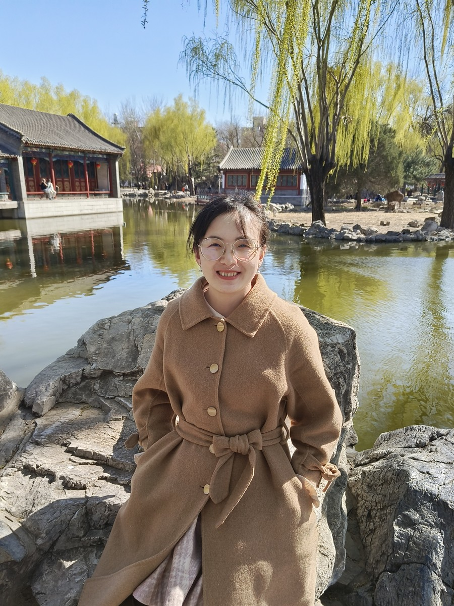

    

      <h2 class="team-card__name">Bingqing Zhang</h2>
      
Postdoc

      
National Astronomical Observatories, Chinese Academy of Sciences

      
Research interests

      
Galaxy Formation and Evolution

    

  </article>

  <article class="team-card">
    
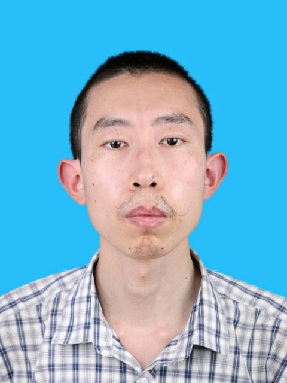

    

      <h2 class="team-card__name">Yubin Li</h2>
      
Faculty

      
National Astronomical Observatories, Chinese Academy of Sciences

      
Research interests

      
Galaxy Formation and EvolutionStudying Galaxy Properties through Stacking Galaxy Images

    

  </article>

  <article class="team-card">
    
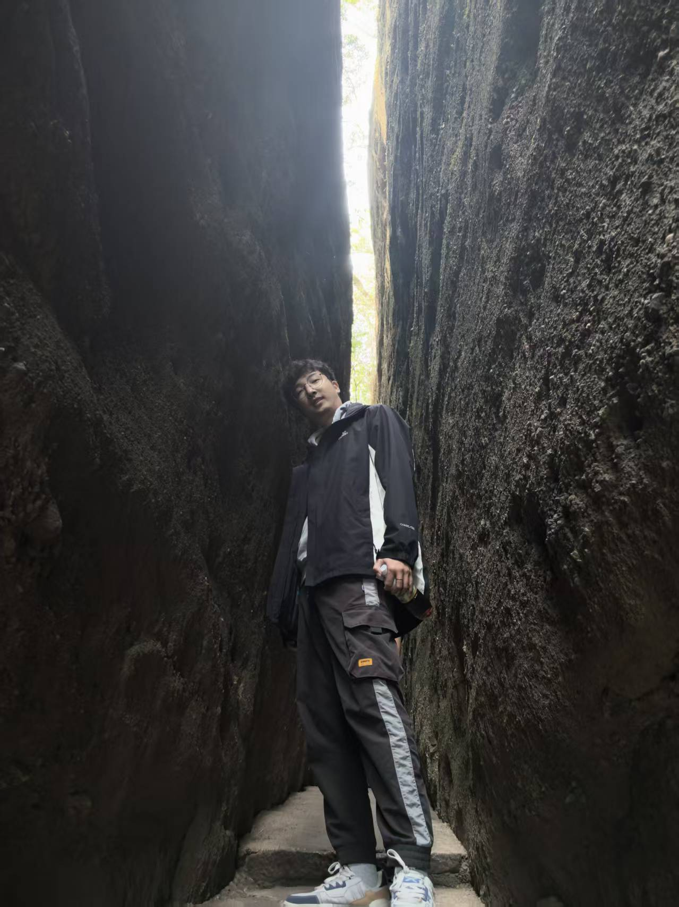

    

      <h2 class="team-card__name">Qifan Cui <a class="team-card__orcid" href="https://orcid.org/0009-0001-5320-1450" target="_blank" rel="noopener" aria-label="Qifan Cui ORCID: 0009-0001-5320-1450">iD</a></h2>
      
Student

      
Shanghai Key Lab for Astrophysics, Shanghai Normal University

      <a class="team-card__email" href="mailto:qifancui@hotmail.com">qifancui@hotmail.com</a>
      
Research interests

      
Galaxy Formation and EvolutionAstronomical Data Reduction

    

  </article>

  <article class="team-card">
    

    

      <h2 class="team-card__name">Mingxiang Fu</h2>
      
Student

      
National Astronomical Observatories, Chinese Academy of Sciences

      
Research interests

      
Galaxy EvolutionMachine Learning for Astronomy

    

  </article>

  <article class="team-card">
    

    

      <h2 class="team-card__name">Hao Mo</h2>
      
Student

      
National Astronomical Observatories, Chinese Academy of Sciences

      
Research interests

      
Galaxy EvolutionActive Galactic Nucleus

    

  </article>

  <article class="team-card">
    
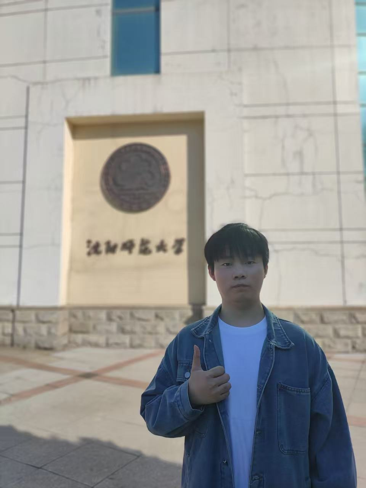

    

      <h2 class="team-card__name">Qi Song <a class="team-card__orcid" href="https://orcid.org/0009-0007-5833-3210" target="_blank" rel="noopener" aria-label="Qi Song ORCID: 0009-0007-5833-3210">iD</a></h2>
      
Student

      
National Astronomical Observatories, Chinese Academy of Sciences

      <a class="team-card__email" href="mailto:songqi@bao.ac.cn">songqi@bao.ac.cn</a>
      
Research interests

      
Lyman-Alpha Emitters (LAEs)Spectroscopic Reduction

    

  </article>

